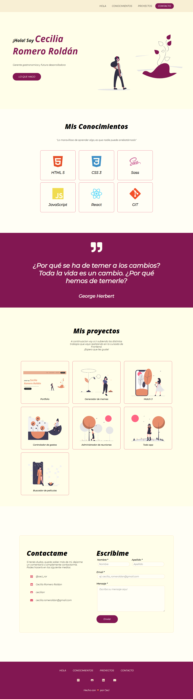

# Portafolio de Ada

### Descripcion

### link [enlace](github) o puedes hacerlo desde [aca]()

 

***

### Si quieres tener el codigo en tu computadora deberas seguir estos pasos

 

***
- Ir al [repositorio](https://github.com/Jonhks/portafolio-ada)  
  - darle click al botón de forkear
  - Darle click al botón de code
  - Copiar la url
  - Abrir tu terminal y poner el comando de **git clone <url>**
  - Entrar a la carpeta del proyecto y abrirlo en tu IDE

  ### Este proyecto no necesita la instalación de ninguna dependencia (por ahora)

  ***
   

  ### Este deberia ser el resultado final de tu instalacion

  

***
 

### Agradecimiento

#### De Cecilia 🧡

